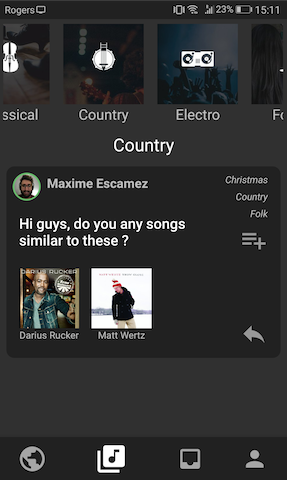

# Aloy

## Our Goal

Have you ever wanted to find a song, artist or an album with the same vibe of another song you like ? Do you want to have
a more humane way to find similar artists ? If yes, then Aloy is made for you. Imagine a fusion between Quora and Spotify.
In Aloy, you will be able to ask and answer questions to redirect or be redirected to particular songs, albums or artists.  
Aloy uses the Spotify database and is directly linked to your Spotify android application so that you can
enjoy your newly found music right away !  
Aloy also features a progression system that advances with every thing you do on the platform. That way, you can brag to your friends or directly
to me if you don't have any friends. 

## How it works ?
Aloy is running on Android version 21 or higher. The app is uses the Spotify API, so you'll need a Spotify account in order to register.
Firebase and Google Cloud Platform are used to handle user's data, login scheme and notifications. Now let's go deeper into how it all works.

## Login
When first launching Aloy, you'll be greeted with this :  
 
  
 
When tapping Spotify button, you'll be asked your Spotify credentials. If you are already logged in on your Spotify android app, you'll just have to accept to log into this one as well. Now that you are logged in, you shouldn't have to log in anymore. We made sure that your access token is always refreshed using Google Cloud Platform. Your experience should now be seamless !

## Global Feed

After logging in, you will land on the Global Feed tab :  
 
  
 
Here you can scroll down to access all the questions asked on the platform from the latest to the earliest. You can also follow a question, scroll vertically to
uncover the albums, artists or songs affiliated with the question or just simply access the answers to that particular question and maybe even add an answer yourself !  
You can also tap on big red circle with the plus in it. This will allow you to ask your own question ! Here's what will happen :  
 
  
 
First, you can fill out the main body of your question. It's quite important, the other users needs to know what you're looking for. The more precise, the better. After that, you can link albums, artists, songs or even genres because sound is better than words right ? The search is on the Spotify database so we don't guarantee you'll find everything you're looking for but at least it's easily accessible on the platform. Once you're done crafting the perfect question you can send it out to the world by submitting it.

## Answers

After tapping on a question, you'll access all of the answers to that question :  
 
  
 
You can, of course, answer yourself but you also can follow the question or even request someone to answer. That lucky person will receive a notification right away informing him that you think he could shed light on the matter. If you want to listen to the artists, songs or albums linked in the questions or answers you only have to tap them and you will be redirected to Spotify instantly.

## Interests Feed

On the Interests Feed tab, the question are sorted by genres. Scroll left and right then choose a genre to access all the question related to it. The genres icons used are courtesy of Spotify.  
 
  
 

## Requests and Following

On the Requests and Following tab you can access the questions you follow (including the ones you asked) and the questions where you've been requested for an answer. Also the Chat tab doesn't work right now, sorry !  
 
  
 

## Profile

At last, on the Profile tab you can access every info about you. Your progression on the platform as well as your questions and answers. Note that you can also access other user's profile by tapping on their name.  
 
  
 
You can also tap on your different achievements to learn where you're at. If you perform well, you'll unlock new colors for your profile picture !
